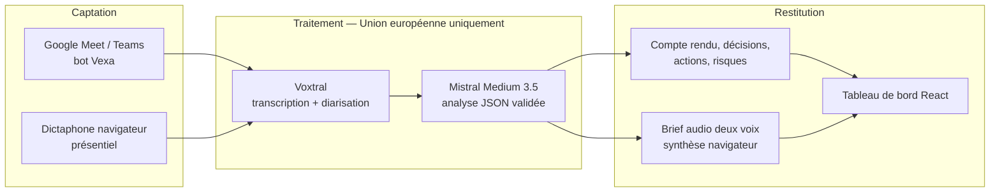
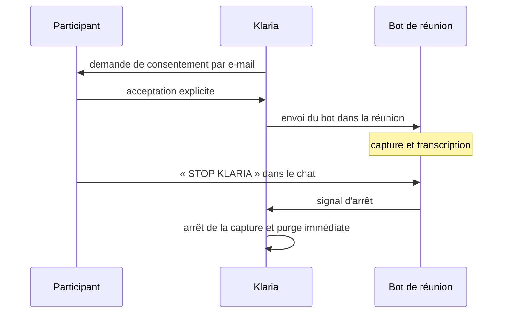

# Klaria

[](https://github.com/AshDv/Klaria/actions/workflows/quality.yml)


**L'assistant de réunion souverain.** Klaria rejoint une réunion Google Meet ou Microsoft Teams, produit une transcription attribuée aux intervenants, et transforme l'échange en compte rendu structuré : décisions, actions, questions ouvertes, risques et brief audio à deux voix. Un mode dictaphone couvre les réunions en présentiel.

Chaque fait extrait est relié à ses segments sources. Aucune donnée ne quitte l'Union européenne.

**Application en ligne :** <https://scribepoc342c95dc-scribe.functions.fnc.fr-par.scw.cloud/>

---

## Sommaire

- [Le problème](#le-problème)
- [Fonctionnalités](#fonctionnalités)
- [Architecture](#architecture)
- [Structure du projet](#structure-du-projet)
- [Démarrage rapide](#démarrage-rapide)
- [Configuration](#configuration)
- [API](#api)
- [Tests et qualité](#tests-et-qualité)
- [Conformité RGPD](#conformité-rgpd)
- [Limites connues](#limites-connues)
- [Documentation](#documentation)
- [Équipe](#équipe)
- [Licence](#licence)

---

## Le problème

Un participant sur deux quitte une réunion sans savoir quelles actions lui incombent, et 30 à 45 minutes sont consacrées au compte rendu manuel après chaque échange. Les outils existants résolvent ce problème, mais hébergent les données aux États-Unis.

Klaria occupe la zone laissée vide : hébergement en France, modèles d'IA européens, diarisation native, et bot compatible Teams **et** Meet. Aucune API américaine n'intervient dans la chaîne de traitement.

## Fonctionnalités

### Captation

- Bot visible dans Google Meet et Microsoft Teams, invité comme un participant ordinaire.
- Dictaphone navigateur pour les réunions en présentiel, sans réseau stable requis.
- Transcription en direct avec attribution des intervenants, diffusée par WebSocket avec repli automatique sur une synchronisation REST.
- Saisie des participants avant l'envoi des demandes de consentement.

### Analyse

- Mistral Medium 3.5 avec sortie JSON validée par un schéma strict.
- Chaque fait extrait cite ses `segment_ids` : aucune affirmation sans passage source.
- Distinction entre décisions **confirmées**, **proposées** et **reportées**.
- Plan d'action avec responsable, échéance et priorité — uniquement lorsqu'ils sont explicites dans l'échange.
- Mentions directes conservant l'auteur, le contexte et les passages justificatifs.
- Table de traçabilité couvrant l'intégralité des segments, y compris les passages non exploités.

### Restitution

- Tableau de bord, bibliothèque de réunions, vue décisions, vue actions et transcription complète.
- Brief audio à deux voix, synthétisé localement par le navigateur.
- Publication du récapitulatif et du lien Klaria dans le chat de la réunion avant le départ du bot.
- Envoi du compte rendu par e-mail, partage par lien, export des données.

### Conformité

- Compte local ou SSO Google et Microsoft via OAuth 2.0 et OpenID Connect.
- Consentement individuel demandé par e-mail avant toute capture.
- Commande `STOP KLARIA` dans le chat : arrêt et effacement immédiats.
- Retrait de consentement d'un participant : arrêt de la capture et purge des données associées.
- Suppression du compte, export intégral et expiration automatique des résultats.

## Architecture



| Couche | Technologies |
|---|---|
| Frontend | React 18, JavaScript, CSS, Vite |
| Backend | Python 3.12, FastAPI, SQLModel, Pydantic |
| Base de données | SQLite en local, PostgreSQL managé en ligne |
| Bot de réunion | Vexa pour Meet et Teams, sans enregistrement audio activé |
| Transcription | Voxtral (`voxtral-mini-latest`), diarisation native |
| Analyse | Mistral (`mistral-medium-3-5`), sortie JSON à schéma strict |
| Hébergement | Conteneur serverless Scaleway (France), Netlify pour le front seul |
| CI/CD | GitHub Actions — `ruff`, `pytest`, build front, déploiement Scaleway |

Le conteneur de production construit le front puis le sert depuis la même image : une seule URL expose l'interface et l'API.

## Structure du projet

```
Klaria/
├── .github/workflows/
│   ├── quality.yml           # ruff + pytest + build front à chaque PR
│   └── deploy-scaleway.yml   # publication du conteneur
├── docs/                     # architecture, déploiement, RGPD, traçabilité
├── server/
│   ├── app/
│   │   ├── main.py           # point d'entrée FastAPI, middlewares de sécurité
│   │   ├── models.py         # schéma de données SQLModel
│   │   ├── auth.py           # mots de passe, jetons de session
│   │   ├── routes.py         # comptes, enregistrements, espace de travail
│   │   ├── consent_routes.py # sessions et pages publiques de consentement
│   │   ├── remote_routes.py  # réunions distantes, WebSocket temps réel
│   │   ├── calendar_*.py     # connexions agenda et automatisation
│   │   ├── legal_routes.py   # mentions légales et acceptation
│   │   ├── vexa.py           # client du bot Meet / Teams
│   │   ├── transcription.py  # Voxtral, diarisation, biais de contexte
│   │   ├── llm.py            # analyse structurée et validation des preuves
│   │   ├── meeting_skills.py # règles d'analyse assemblées en un prompt
│   │   ├── retention.py      # purge des données expirées
│   │   └── token_crypto.py   # chiffrement des jetons OAuth stockés
│   ├── tests/                # 66 tests unitaires et d'intégration
│   ├── Dockerfile            # build front + API dans une seule image
│   └── .env.example
├── web/src/                  # interface React
├── teams-app/                # paquet d'installation Microsoft Teams
└── start.ps1                 # démarrage automatisé sous Windows
```

## Démarrage rapide

### Prérequis

Python 3.12, Node.js 22, et une clé API Mistral. Le reste est optionnel selon les fonctionnalités souhaitées.

### macOS et Linux

```bash
git clone https://github.com/AshDv/Klaria.git
cd Klaria

# Backend
cd server
python3 -m venv .venv
source .venv/bin/activate
pip install -r requirements.txt
cp .env.example .env          # renseigner au minimum MISTRAL_API_KEY
python -m uvicorn app.main:app --reload --port 8000

# Frontend, dans un second terminal
cd web
npm install
npm run dev
```

### Windows

Le script prépare l'environnement, installe les dépendances et ouvre les deux serveurs :

```powershell
powershell -ExecutionPolicy Bypass -File .\start.ps1
```

### Points d'entrée

| Service | URL |
|---|---|
| Interface | <http://localhost:5174> |
| API | <http://localhost:8000> |
| Documentation interactive | <http://localhost:8000/docs> |
| État des services | <http://localhost:8000/api/health> |

`/api/health` indique quelles fonctionnalités sont réellement actives selon votre configuration : analyse, SSO, e-mail, bot de réunion, persistance de la base.

## Configuration

Toute la configuration passe par `server/.env`, dérivé de `server/.env.example`. Aucun secret ne doit être committé.

### Minimum pour démarrer

| Variable | Rôle |
|---|---|
| `SECRET_KEY` | Signature des jetons de session — une valeur aléatoire longue |
| `DATABASE_URL` | `sqlite:///./klaria.db` en local |
| `MISTRAL_API_KEY` | Transcription Voxtral **et** analyse Mistral, une seule clé |

### Bot de réunion en ligne

| Variable | Rôle |
|---|---|
| `VEXA_API_KEY` | Obligatoire pour envoyer un bot dans Meet ou Teams |
| `VEXA_BOT_NAME` | Nom affiché du bot aux participants |

### Invitations de consentement

| Variable | Rôle |
|---|---|
| `SMTP_HOST`, `SMTP_PORT` | Serveur d'envoi |
| `SMTP_USERNAME`, `SMTP_PASSWORD` | Authentification |
| `SMTP_FROM_EMAIL` | Adresse d'expédition |

Sans SMTP, Klaria ne crée aucune session de consentement — et n'envoie donc aucun bot. C'est volontaire : le consentement précède la capture.

### SSO et agendas

| Variable | Rôle |
|---|---|
| `GOOGLE_CLIENT_ID`, `GOOGLE_CLIENT_SECRET` | Connexion Google et accès à l'agenda |
| `MICROSOFT_CLIENT_ID`, `MICROSOFT_CLIENT_SECRET` | Connexion Microsoft et accès à l'agenda |
| `TOKEN_ENCRYPTION_KEY` | Chiffrement des jetons d'agenda en base |
| `AUTOMATION_KEY` | Active la boucle d'automatisation des réunions planifiées |

### Rétention et mentions légales

| Variable | Rôle |
|---|---|
| `RESULT_RETENTION_DAYS` | Durée de conservation des résultats, 30 jours par défaut |
| `DATA_CONTROLLER_NAME`, `DATA_CONTROLLER_ADDRESS` | Responsable de traitement affiché |
| `PRIVACY_CONTACT_EMAIL` | Contact pour l'exercice des droits |

## API

L'ensemble des routes est préfixé par `/api` et documenté sur `/docs`. Les principales :

| Méthode | Route | Rôle |
|---|---|---|
| `POST` | `/api/auth/register`, `/api/auth/login` | Compte local |
| `GET` | `/api/auth/sso/google`, `/api/auth/sso/microsoft` | Connexion SSO |
| `POST` | `/api/consent-sessions` | Créer une session et envoyer les demandes |
| `GET` | `/api/public/consents/{token}` | Page publique de consentement |
| `POST` | `/api/public/consents/{token}/withdraw` | Retrait, arrêt et purge |
| `POST` | `/api/remote-meetings` | Envoyer le bot dans une réunion |
| `WS` | `/api/remote-meetings/{id}/live` | Transcription en direct |
| `POST` | `/api/remote-meetings/{id}/stop` | Arrêt manuel du bot |
| `POST` | `/api/remote-meetings/{id}/reanalyze` | Relancer l'analyse |
| `POST` | `/api/recordings` | Déposer un enregistrement dictaphone |
| `GET` | `/api/privacy/export` | Export intégral des données |
| `DELETE` | `/api/privacy/account` | Suppression du compte |

## Tests et qualité

La suite couvre 66 tests répartis en 10 fichiers. **Aucun test n'appelle un service d'IA réel** : les réponses de Mistral, Voxtral et Vexa sont simulées par `monkeypatch`. Les tests s'exécutent hors ligne, sans clé API et sans base à préparer.

```bash
# Depuis la racine du dépôt
python -m pytest -q          # 66 tests
python -m pytest -v          # détail test par test
python -m ruff check server/app server/tests
cd web && npm run build
```

| Fichier | Couvre |
|---|---|
| `test_api.py` | Comptes, consentement, confidentialité, suppression |
| `test_llm.py` | Traçabilité, protection des identités, analyse simulée |
| `test_security.py` | Mots de passe, jetons de session, chiffrement des jetons |
| `test_vexa.py` | Liens Teams, déduplication des segments, faux locuteurs |
| `test_remote_meetings.py` | Cycle de vie complet d'une réunion distante |
| `test_remote_processing.py` | Détection de la commande `STOP KLARIA` |
| `test_calendar.py` | Extraction des liens et participants d'un événement |
| `test_meeting_artifacts.py` | Confirmation des locuteurs, qualité du rapport |
| `test_processing.py` | Chaîne dictaphone et effacement de l'audio |
| `test_transcription.py` | Biais de contexte sur les noms de participants |

Le workflow `quality.yml` rejoue ces contrôles à chaque pull request.

## Conformité RGPD

La protection des données est une contrainte d'architecture, pas une option de configuration.



- **Consentement préalable.** Aucun bot n'est envoyé tant que les participants n'ont pas reçu et accepté leur demande.
- **Arrêt à la main du participant.** `STOP KLARIA` dans le chat, ou retrait depuis la page publique de consentement.
- **Minimisation.** Le bot est configuré sans enregistrement audio ; l'audio du dictaphone est supprimé dès la fin du traitement.
- **Souveraineté.** Voxtral et Mistral sont des services européens. Les modèles chinois ont été écartés : même accessibles via une API européenne, leurs éditeurs restent soumis à un droit permettant l'accès aux données.
- **Chiffrement.** Les jetons OAuth d'agenda sont chiffrés en base.
- **Expiration.** Une purge automatique supprime réunions, événements et enregistrements au-delà de la durée de rétention.
- **Droits.** Export intégral et suppression de compte accessibles depuis l'interface.

Le détail figure dans [`docs/PRIVACY.md`](docs/PRIVACY.md).

> Le code fournit des mesures techniques de protection des données. Les informations légales, les contrats de sous-traitance et les durées de conservation doivent être validés juridiquement avant toute mise en production réelle.

## Limites connues

- **Dépendance à un fournisseur tiers.** La captation en visioconférence repose sur Vexa. Une indisponibilité de ce service empêche l'envoi du bot.
- **Teams.** Lorsque le lien collé n'est pas au format `teams.live.com/meet/...`, l'identifiant numérique et le code secret présents dans l'invitation sont exigés.
- **Diarisation.** L'attribution des voix dépend des libellés fournis par la plateforme. En l'absence de preuve, Klaria conserve volontairement un intervenant non identifié plutôt que de deviner un nom.
- **Brief audio.** La synthèse vocale utilise les voix du navigateur : le rendu varie d'un poste à l'autre.
- **Frontend non testé.** La couverture automatisée porte sur le backend uniquement.

## Documentation

| Document | Contenu |
|---|---|
| [`docs/S2_ARCHITECTURE.md`](docs/S2_ARCHITECTURE.md) | Architecture détaillée |
| [`docs/DEPLOYMENT.md`](docs/DEPLOYMENT.md) | Mise en ligne |
| [`docs/PRIVACY.md`](docs/PRIVACY.md) | Cycle de vie des données et droits |
| [`docs/RNCP_TRACEABILITY.md`](docs/RNCP_TRACEABILITY.md) | Traçabilité des compétences |
| [`CONTRIBUTING.md`](CONTRIBUTING.md) | Règles de contribution |
| [`teams-app/README.md`](teams-app/README.md) | Installation du paquet Teams |

## Équipe

Projet réalisé à quatre, du 22 juillet au 3 septembre 2026, en sprints de deux semaines suivis sur Jira, avec relecture croisée systématique des pull requests.

| Membre | Périmètre principal |
|---|---|
| **DEVADEVAN Ashwin** | Transcription et diarisation, bot Vexa, application Teams |
| **ZEDIRA Yanis** | Intelligence de réunion, tableau de bord, brief audio |
| **DJERAD Aymen** | Authentification, SSO, consentement, RGPD, agendas |
| **BEN CHEIKH Mehdi** | Domaine et API réunions, CI/CD, hébergement, interface |

Projet de fin d'études HETIC, dans le cadre du titre **RNCP 36146 — Concepteur développeur de solutions digitales** (niveau 6).

## Licence

Distribué sous licence MIT. Voir le fichier [`LICENSE`](LICENSE).
